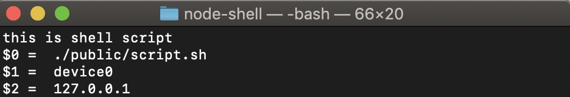

### Requirement

[NodeJS](https://nodejs.org/en/download)

## Run

    node .

`Server running on port 3030`

> http://localhost:3030

## Usage example




1. Go to http://localhost:3030/usage.html
2. Click the `Exec shell command`
3. See the terminal to check for the output

Calling API at http://localhost:3030/exec

See `terminal`, these should be the output

```
Executing, shellJS
Hello, hello
good bye
```

## The code

> `index.js line 20`

```javascript
app.get('/exec',(req,res,next)=>{
  const shell = require('shelljs')
  shell.exec('echo Executing, shellJS')
  shell.exec('echo Hello, hello')
  shell.exec('echo good bye')
})
```

For more supported shell commands in `ShellJS` refer to `https://github.com/shelljs/shelljs`

### Usage

See `public/usage.html`

### Note

NodeJS support to exec shell command built-in by default

> https://repl.it/@mjunaidi/NodeJS-ShellJS-example

```javascript
const {exec} = require('child_process')

function execute(cmd,cb) {
  exec(cmd, (err,stdout,stder)=>{
    if (typeof(cb)==='function') cb(stdout)
  })
  return null
}

execute("echo hello", s=>{
  console.log(s)
})
```

ShellJS helps simplify using it with a lot of other handlers.
